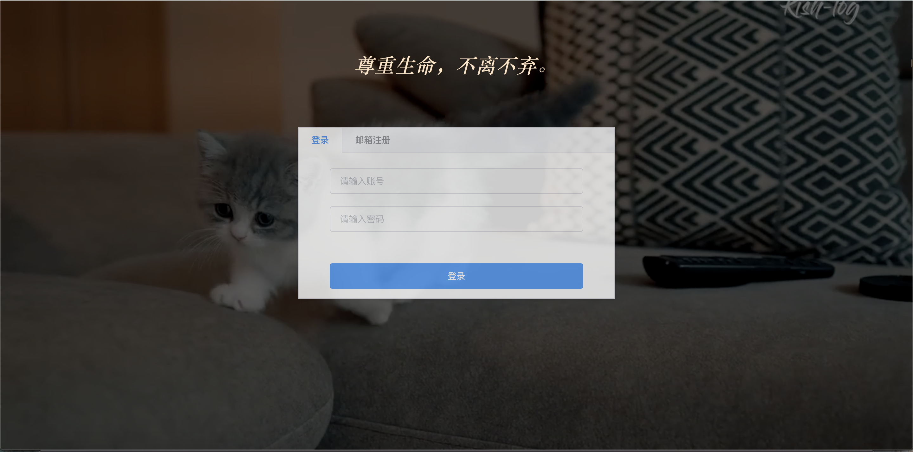
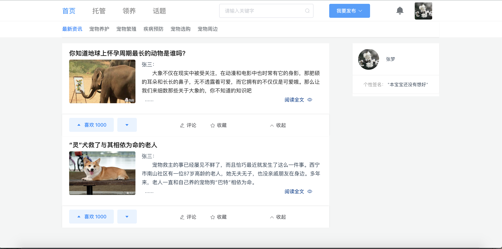
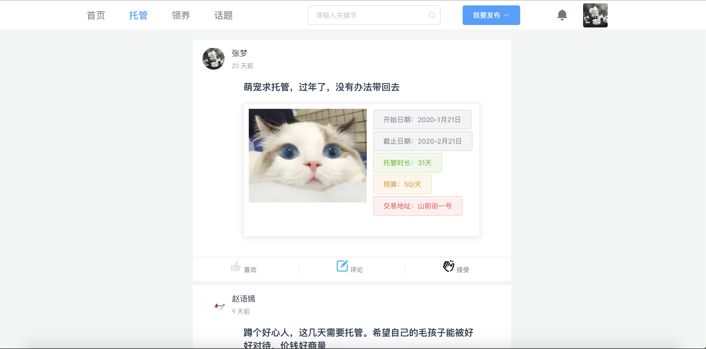
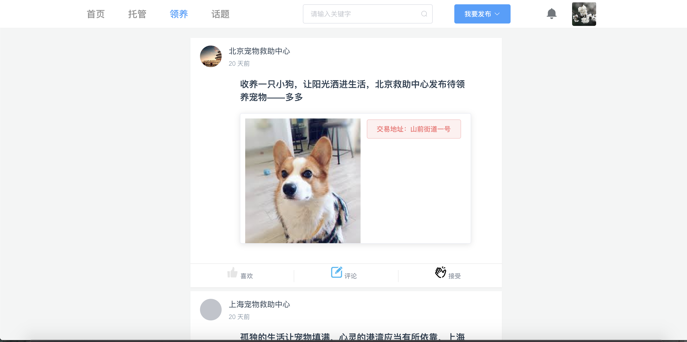
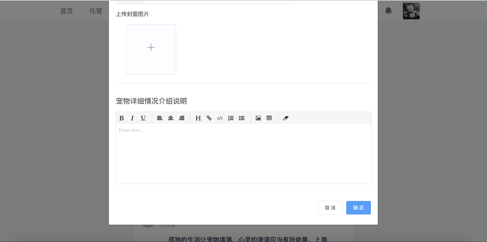
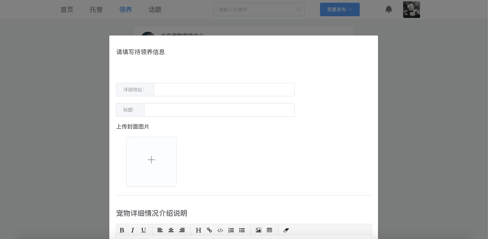

#### 前言
比赛项目，简单实现了关于宠物托管、领养的功能。`很多功能尚未完善`，很水。

此仓库为前端代码，后端项目参考 [Gitee 后端代码托管仓库](https://gitee.com/zhaofengling/pet-master/tree/master)

### 项目结构

* components --- 组件包
* config    --- 配置包
    * router.js --- 路由配置
    * store.js  --- 单一状态数
* page  --- 主页面

### 技术选型

|       | 描述 | 地址|
| ---   | ---  |   ---    |
| vue.js       | 项目开发框架  |   [github地址](https://github.com/vuejs/vue#readme)   |
| element-ui   | 组件库       |   [官网地址](http://element.eleme.io/)   |
| axios        | 异步请求工具  |   [github地址](https://github.com/axios/axios)    |
| moment        | 日期格式化工具  |   [官网地址](https://momentjs.com/)   |
| qiniu-js        | 七牛云skd，用于图片上传  |   [github地址](http://github.com/qiniu/js-sdk.git)   |
| vue-typed-js        | 打字效果  |   [官网地址](https://mattboldt.com/demos/typed-js/)    |
| vue-router        | 路由组件  |   [github地址](https://github.com/vuejs/vue-router#readme/)    |
| vue-video-section        | 视频背景组件，本项目用于登录页面  |   [github地址](https://github.com/johndatserakis/vue-video-section)    |
| vuex        | 状态存储管理  |   [github地址](https://github.com/vuejs/vuex#readme)    |
| vue-wysiwyg        | 富文本编译器  |   [地址](https://www.npmjs.com/package/vue-wysiwyg)    |

### web预览
* 登录页面

* 资讯界面

* 托管界面

* 领养界面

* 领养消息发布效果图

